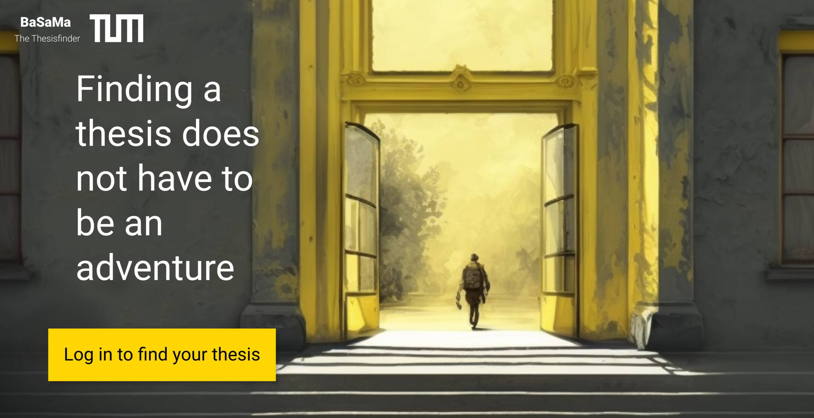

# BaSaMa (Bachelor-/Semester-/Masterthesis management)

> [!NOTE]
> This project is currently WIP.
> If you like to get involved, please write an issue ^^

Eventual goals:
- [ ] whitelabel solution (any university can use this, not just TUM)
- [ ] employees can manage/pubilsh thesis
- [ ] students can seach for pubished thesis
- [ ] students can get in touch with a potential supervisor

Potential goals:
- [ ] the abiltiy to replace university wide job portals [portal.mytum.de/jobs](https://portal.mytum.de/jobs/sonstige)

## UI-Samples

